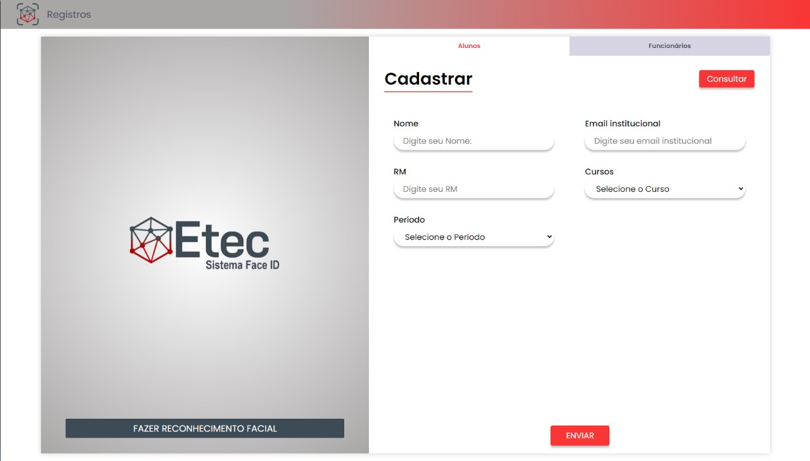

# **TCC-Reconhecimento-Facial**

>* Desenvolvido para controle de acesso e saída na ETEC
>* Linguagens utilizadas: Javascript e PHP; juntamente com HTML, CSS e SQL para banco de dados

 

># Tela de cadastro

